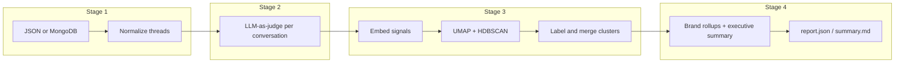

# Conversation Intelligence Pipeline

Automated analysis of e-commerce AI assistant chat logs: ingest conversations, score each thread with an LLM judge, discover recurring failure themes via embeddings + clustering, and produce executive-ready reports plus a Streamlit dashboard.

## Architecture



- **Stage 1 — Ingest**: Loads `conversations` + `messages`, splits agent payloads at `End of stream\n` into visible reply vs product JSON (ground truth for hallucination checks). Supports **MongoDB** or flat **JSON** (`DATA_SOURCE` in config).
- **Stage 2 — Evaluate**: Azure OpenAI with structured JSON output; rubric dimensions include factual accuracy, hallucination vs catalog, policy, tone, satisfaction signals, cross-brand checks.
- **Stage 3 — Discover**: Sentence-transformer embeddings, UMAP reduction, HDBSCAN clustering, LLM cluster labels, embedding + LLM merge passes, conversation-ID overlap merge, noise filtering, optional **parent theme** tagging (e.g. cross-brand vs order issues).
- **Stage 4 — Aggregate**: Per-brand metrics, top failure clusters per brand, worst conversations, LLM-written executive summary, markdown export.

## Prerequisites

- Python **3.11+** (recommended)
- **Azure OpenAI** deployment compatible with Chat Completions + `json_schema` response format (e.g. `gpt-4o-mini`)
- Optional: **MongoDB** with `helio_intern` database if using `DATA_SOURCE=mongodb`

## Setup

```bash
python -m venv .venv
.venv\Scripts\activate   # Windows
# source .venv/bin/activate  # macOS/Linux

pip install -r requirements.txt
cp .env.example .env
# Edit .env: OAI_BASE_LLM, OAI_KEY_LLM, OAI_VERSION
```

### Data: JSON (default)

Place `conversations.json` and `messages.json` under `data/` (as in the take-home), or set `DATA_DIR` in `src/config.py`.

### Data: MongoDB (assignment path)

```bash
mongoimport --db helio_intern --collection conversations --file conversations.json --jsonArray
mongoimport --db helio_intern --collection messages --file messages.json --jsonArray
```

Set in `.env`:

```env
DATA_SOURCE=mongodb
MONGO_URI=mongodb://localhost:27017
MONGO_DB=helio_intern
```

## Run

```bash
# From repository root
python pipeline.py
```

- First run calls the API for every conversation (cached in `output/all_evaluations.json` if present — delete that file to re-evaluate).
- Outputs: `output/report.json`, `output/summary.md`, `output/clusters.json`, `output/evaluations.json`.

### Dashboard

```bash
streamlit run dashboard/app.py
```

Open the URL shown in the terminal. The app reads `output/report.json` and, when present, `output/all_evaluations.json` for score distributions and `data/messages.json` + `data/conversations.json` for transcript drill-down.

## Design decisions (short)

| Choice | Rationale |
|--------|-----------|
| LLM-as-judge vs rules | Captures nuance (tone, resolution, cross-brand) that regex cannot; product JSON gives hallucination ground truth. |
| HDBSCAN vs k-means | No need to pick *k*; handles noise points. |
| UMAP before HDBSCAN | Stabilizes density-based clustering on medium-sized text-embedding sets. |
| `gpt-4o-mini` | Cost/latency vs quality tradeoff for 300+ calls; upgrade path to larger models. |
| JSON default + Mongo option | Fast local iteration; Mongo matches production import instructions. |

See **[DESIGN.md](DESIGN.md)** for tradeoffs and what we’d extend next.

## Tests

```bash
pytest
```

## Limitations

- Judge scores are **not** calibrated against human labels (appropriate for a take-home; production would add spot-checks / golden sets).
- Cluster granularity depends on HDBSCAN hyperparameters and merge thresholds; themes are assistive, not ground truth. Tune `CLUSTER_LABEL_MERGE_THRESHOLD` / `CLUSTER_CONVERSATION_OVERLAP_THRESHOLD` in `.env` if clusters over-merge.
- Stage 2 throughput: default `MAX_CONCURRENT_EVALS=20` (see `.env.example`); lower if you hit rate limits.
- Brand names for unknown `widgetId`s are inferred from URLs when possible; override via `BRAND_MAP` in `src/config.py`.

## Sample finding (illustrative)

After a full run, reports often highlight **cross-brand contamination** (wrong domains, wrong support email) and **order/cancel clarity** gaps — with per-brand resolution and hallucination rates in `report.json` and the dashboard.

## Project layout

```
pipeline.py
dashboard/app.py
src/
  config.py
  models.py
  prompts.py
  logging_config.py
  text_utils.py
  evaluation_schema.py
  stage1_ingest.py
  stage2_evaluate.py
  stage3_discover.py
  stage4_aggregate.py
data/           # or use MongoDB
output/         # generated (gitignored)
tests/
```
